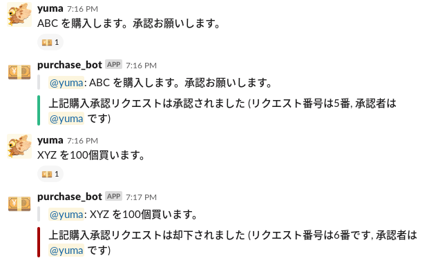

# slack-purchase-bot

Slack で購入申請＆承認管理ができる bot です。

※ ご利用は自己責任でお願いいたします。

## 動作例




## 動作環境

- Python 3.5 〜
- Redis

## 動かし方 (docker-compose)

- Slack の App から Incoming Webhook を作成
- docker-compose.yml を編集
    - 作成した Webhook の Token を `SLACK_TOKEN` に記入
    - 投稿先チャンネルの ID を `SLACK_CHANNEL_ID` に記入
- 以下のコマンドで Bot を立ち上げる

```bash
$ docker-compose up --build [-d]
```

## 使い方 (Slack)

### 利用者側

* 購入申請
    * `$PURCHASE_CHANNEL` で指定したチャンネルで承認者以外がメッセージを投稿
    * 申請が登録されると Bot による Reaction が付きます

### 承認者側
    
* 承認者登録する
    * ダイレクトメッセージで「承認者登録」
* 承認者登録を解除する
    * ダイレクトメッセージで「承認者解除」
* 未承認の一覧を表示
    * 承認者ユーザがダイレクトメッセージで「未承認」
* 承認する
    * 承認者ユーザがダイレクトメッセージで「承認 ID1 [ID2] ...」or 「承認 ID1-IDN」
    * 申請が承認された旨が Bot によって投稿されます
* 却下する
    * 承認者ユーザがダイレクトメッセージで「却下 ID1 [ID2] ...」or 「却下 ID1-IDN」
    * 申請が却下された旨が Bot によって投稿されます
* 無視する
    * 承認者ユーザがダイレクトメッセージで「無視 ID1 [ID2] ...」or 「無視 ID1-IDN」
